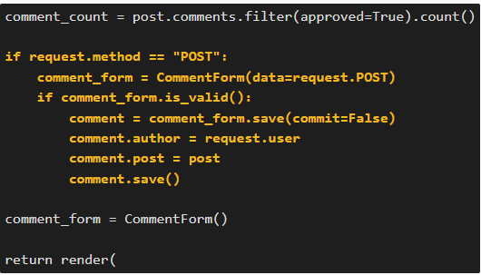

# INITIATE A DJANGO PROJECT, USEFUL COMMANDS

I created this file as a handy guide when working with a Django project.

### CONTENTS

* [Part 01: Creating the project](#part-01-creating-the-project)
  * [Installing packages](#installing-packages)
  * [Creating the Django project](#creating-the-django-project)  

* [Part 02: Creating the new app](#part-02-creating-the-new-app)  

* [Part 03: Running the server and testing the app](#part-03-running-the-server-and-testing-the-app)

* [Part 04: Deployment](#part-04-deployment)
    * [Create the Heroku app](#create-the-heroku-app)
    * [Update the code for deployment](#update-the-code-for-deployment)
    * [Deploy to Heroku](#deploy-to-heroku)

* [Part 05: Creating the database](#part-05-creating-the-database)
    * [env.py](#env.py)
    * [Install packages](#install-packages)
    * [Import packages](#import-packages)
    * [Database connection](#database-connection)

### Part 01: Creating the project

**Installing packages**: 
- Install the Django Python package: `pip3 install Django~=4.2.1`
- Add it to the requirements.txt file: `pip3 freeze --local > requirements.txt`

**Creating the Django project**:
- `django-admin startproject project_name .`
- **Don't forget the dot at the end.** The dot specifies the directory location. 
- Migrate changes and keep the database updated, when there are changes in models.py: `python3 manage.py migrate`
- In **my_project/settings.py** file, paste the hostname between the square brackets of `ALLOWED_HOSTS` and save: `ALLOWED_HOSTS = ['8000-reponame-djangoproject-randomdigitsandletters.ws-eu111.gitpod.io']`
- Start the Django server: `python3 manage.py runserver`
--------
### Part 02: Creating the new app
- `python3 manage.py startapp app_name`
- In **settings.py** add the app to the list of `INSTALLED_APPS`
- Surround the app name in single quotes, and use a trailing comma before and after

- In **views.py** import `from django.http import HttpResponse` at the top of the file
- Add a view function to return a HttpResponse e.g. "Hello, Blog!":
`def my_blog(request):
return HttpResponse("Hello, Blog!")`

- In **my_project/urls.py** import the **include** function by appending it after a comma to the existing *django.urls import.*
- Import the my_blog view: `from blog.views import my_blog`
- Add the new path to the urlpatterns: `path('blog/', my_blog, name='blog'),`
--------
### Part 03: Running the server and testing the app
- Always make sure to **save all your files** before running the project. You can also take this opportunity to git add, commit and push your work.
- Open a browser window by returning to the terminal tab and running the Django server `python3 manage.py runserver`. Now you can see the text from the view function in the browser.
- In **settings.py** make sure to have pasted the **hostname** inside the `ALLOWED_HOSTS` before running the project.
--------
### Part 04: Deployment
> **Create the Heroku app**
- On the **Settings tab** click reveal config vars. 
- Add a key of DISABLE_COLLECTSTATIC and a value of 1 and click Add.

> **Update the code for deployment**
- Install a production-ready webserver for Heroku: `pip3 install gunicorn~=20.1`
- Add gunicorn==20.1.0 to the requirements.txt file: `pip3 freeze --local > requirements.txt`
*Note: gunicorn is a production equivalent of the manage.py runserver used in development but with speed and security optimisation.*

- Create a file named **Procfile** at the root directory of the project (same directory as requirements.txt).
*Note: The Procfile has no file extension.*
- In the Procfile, declare this is a web process followed by the command to execute your Django project: `web: gunicorn my_project.wsgi`. *Note: This assumes your project is named my_project.*
- Note the **space** after the colon.

*Note: gunicorn my_project.wsgi is the command heroku will use to start the server. It works similarly to python3 manage.py runserver.*

- In **settings.py** file replace DEBUG=True with DEBUG=False
- Append the Heroku hostname to the ALLOWED_HOSTS list, in addition to the local host: `,'.herokuapp.com'` *Note: Remember the comma and the dot before herokuapp.*
- Push the code to GitHub:
1.  git add .
2. git commit -m "..."
3. git push

> **Deploy to Heroku**
- On the Deploy tab in the Heroku app dashboard: 1. connect to the GitHub repo, 2. click on Deploy Branch
- You will see a 404 error that the current path didn’t match any of the URL patterns as you have not written the urlpattern yet.- Append /app_name (/blog in this case) to the app URL to see the text.

--------

### Part 05: Creating the database

- In the **settings.py** file change the value of DEBUG back to True
> **env.py**
- Create a file named **env.py** at the top level of the project. *Note: You can either create a new file in the file structure or type the terminal command touch env.py*
- Add env.py to the **.gitignore file**. This is to prevent the secret data you will add to it from being pushed to GitHub.
- Import Python's operating system module and use it to set the value of the DATABASE_URL constant to the URL you copied from the chosen PostgreSQL database: `import os`, `os.environ.setdefault(
    "DATABASE_URL", "<your-database-URL>")`

> **Install packages**
- Install the two packages required to connect to your PostgreSQL database: `pip3 install dj-database-url~=0.5 psycopg2~=2.9`
- Then add them to the requirements file: `pip3 freeze --local > requirements.txt` or `pip freeze >> requirements.txt`
- *Note 1: psycopg2 is a driver for interacting with PostgreSQL databases using Python. The dj-database-url Python package is a utility to connect Django to a database using a URL.*
- *Note 2: The packages in requirements.txt are listed alphabetically. The most recently installed package is not always at the end.*
- *Note 3: The requirements.txt file is an important part of the deployment. After each new package is installed, recreate the file.*
- See the installed packages: `pip3 list`

> **Import packages**
- In **settings.py** file, import the appropriate packages
    - Connect the settings.py file to the env.py file*:
        - `import os`
        - `import dj_database_url` *Note: You will use dj_database_url in a later step* 
        - `if os.path.isfile('env.py'): import env`

> **Database connection**
- In the **settings.py** file comment out the local sqlite3 database connection
- Connect to the environment variable DATABASE_URL you previously added to the env.py file: `DATABASES = {
    'default': dj_database_url.parse(os.environ.get("DATABASE_URL"))
}`
- Now our project is connected to the database and we can create database tables with Django's migrate command: `python3 manage.py migrate`

--------

### Part 06: Entering data
Let's enter our first data into the database. As Django comes with built-in auth and admin apps we can create a superuser with admin access to our database:
> **superuser**
- Choose a memorable user name, use your email address and choose a secure password:
`python3 manage.py createsuperuser`
- *Note: Django will check your password security.*

#### USE THE NEXT SECTION CAREFULLY!!!
> **Run commands to view information in CI database:**
Use the Django shell in order to run commands to view this information.
The Django shell allows you to write Python statements from the command line although they're being executed from within Django.
Run the command `python3 manage.py shell` to open the Django shell, where you can type the code line by line, or paste it in one go.
- We can query the tables that exist in the database with the following code snippet:

    - `from django.db import connection`
    - `table_names = connection.introspection.table_names()`
    - `print(table_names)`

- To query the users within the User model, you can run the following code snippet:
    - `from django.contrib.auth.models import User`
    - `users = User.objects.all()`
    - `for user in users:
    print(f"Username: {user.username}, Email: {user.email}, First Name: {user.first_name}, Last Name: {user.last_name}")`

- In order to exit the Django shell, type `exit`
--------
### Part 4b: Deployment and connecting Heroku to the PostgreSQL database
- On the **Settings tab** click reveal config vars. 
- Add a new config var with a key of `DATABASE_URL` and the value of the PostgreSQL database URL.
- *Note: You can copy this from your env.py file (minus the quotes)*

--------

### Part 07: SECRET_KEY
> **env.py**
- Make up a new SECRET_KEY value: `os.environ.setdefault(
    "SECRET_KEY", "comeupwithacombinationofletters,numbersandsymbols"
)`

> **settings.py**
- Modify the settings.py file to retrieve the new SECRET_KEY from the environment variables: `SECRET_KEY = os.environ.get('SECRET_KEY')`

> **Heroku**
- Set the SECRET_KEY as a config variable on Heroku
- Push the code to Github and redeploy
- *Note: If you run both the local and browser app, and get no errors after adding the SECRET_KEY to both, it should mean the change has been successful.*

--------

### Part 08: Creating the model
- Debug > True
- In my_app/**models.py** file add a new import at the top for the User model: `from django.contrib.auth.models import User`
    - Create a class named `Post` below the comment inheriting from the `Model` class: `class Post(models.Model):`
        - Add an attribute *title* defined as a *character field* with a max length of 200 characters: `title = models.CharField(max_length=200, unique=True)` Note: The title values should be unique to avoid having blog posts of the same name confusing your users.
        - Add an attribute *slug* defined as a *slug field* with a max length of 200 characters: `slug = models.SlugField(max_length=200, unique=True)` Note: In Django, the slug is what you'll use to build a URL for each of your posts. 
        - Add an attribute *author* defined as a *Foreign Key* to the User model: `author = models.ForeignKey(
    User, on_delete=models.CASCADE, related_name="blog_posts"
)` Note: One user can write many posts, so this is a one-to-many or Foreign Key. The cascade on delete means that on the deletion of the user entry, all their posts are also deleted.
        - Add an attribute *content* defined as a *text field*: `content = models.TextField()` Note: This is the blog article content.
        - Add an attribute *created_on* defined as a *date time field*: `created_on = models.DateTimeField(auto_now_add=True)` Note: The auto_now_add=True means the default created time is the time of post entry.
        - Add an attribute *status* defined as an *integer field* with a default of 0: `status = models.IntegerField(choices=STATUS, default=0)`
            - Create the constant STATUS above the class as a tuple: `STATUS = ((0, "Draft"), (1, "Published"))` Note: A draft is defined as zero and published as one, so you can see the default is to save as a draft.     

--------

### Part 09: Use the model to update the database
Now we have created a Post model we need to convert that Python class into instructions for the creation of the database table structure.

- `python3 manage.py makemigrations blog` Note: A blog/migrations/0001_initial.py file is created containing the instructions on what table to build.
- `python3 manage.py migrate blog`: we create that table in the database.
- In my_app/**admin.py** file import the Post model and register it:
    - `from .models import Post`
    - `admin.site.register(Post)` (Register it here: *# Register your models here.*)
- In my_project/**settings.py** file add:
    - `CSRF_TRUSTED_ORIGINS = [
    "https://*.codeanyapp.com",
    "https://*.herokuapp.com"
]` Note: you need to add **your local development server URL domain** (e.g gitpod.io if you work on Gitpod) and your **production server URL domain**
- Start the Django server in the terminal: `python3 manage.py runserver`
    - open the app and append /admin to the URL in the browser
    - log in as the superuser
    - There is now a Posts option under Django Administration.

- Debug > False
- Git add, commit, push
- Deploy on heroku > Open the app, append /admin to the URL in the browser and log in as the superuser. There is now a Posts option under Site Administration. 

--------
### Part 10: VIEWS Part 1
In these steps, we'll create the main page for our blog using Django's generic views. 

> **Preparatory steps**
- In my_app directory (blog in this case) create a new Python file named **urls.py**
- In my_project/**urls.py** file:
    - Delete the blog_views import (Our app (blog) has now its own URL file)
    - Ensure that `include` is imported from django.urls by appending it after path
    - Replace the existing blog/ urlpattern with a new empty string urlpattern: 
        - `path('blog/', my_blog, name='blog'),` gets replaced by: `path("", include("blog.urls"), name="blog-urls"),`
        - This pattern tells Django to look in the blog app URL file for any blog urlpatterns
- In my_app, create a **templates directory** with another directory nested within, named e.g. blog : `mkdir -p blog/templates/blog`
    - In this new directory, create a new HTML file named `post_list.html ` and paste the [HTML code provided](https://github.com/Code-Institute-Solutions/blog/blob/main/06_views_part1/02_building_homepage/post_list.html)
- In the my_app/**views.py** file, delete the existing blog function-based view and the HttpResponse import.

> **How to create a class-based view**
- In my_app/**views.py** file: import **generic** from django.views and import the **Post model**: 
    - `from django.views import generic`
    - `from .models import Post`
- In my_app/**views.py** file: **create a class-based view** named PostList that inherits from the generic.ListView class to display all your posts:
    - `class PostList(generic.ListView):
    model = Post`
- In my_app/**urls.py** file import the views file and path:
    - `from . import views`
    - `from django.urls import path`
    - Add a urlpattern for your PostList class-based view named home: `urlpatterns = [
    path('', views.PostList.as_view(), name='home'),
]`
    - In this class add: `queryset = Post.objects.all()`, `template_name = "post_list.html"`
    

--------
### Part 11: Summernote
In these steps, we'll enhance the admin panel to simplify the process of adding and editing blog posts for the superuser. We'll introduce Summernote, a robust text editor, to achieve this.
> **Install and wire up the package**
- Install the django-summernote package: `pip3 install django-summernote~=0.8.20.0`
- Add the django-summernote package to the requirements.txt file
- In the **my_project/settings.py** file:
    - Append summernote to the INSTALLED_APPS: `'django_summernote',`
    - *Note that the dash in the package name is replaced with an underscore in the INSTALLED_APPS list*
    - *Remember the quotes and trailing comma*
- In **my_project/urls.py** file include the summernote urlpattern:
    - `path('summernote/', include('django_summernote.urls')),`
    - *Note: django_summernote is an app, that is why we are including its urls.py file*
    - *Note: Order the string paths alphabetically, with the empty string path last*

> **Update the blog app to use summernote**
- In the **my_app/admin.py** file import the class SummernoteModelAdmin from the django_summernote/admin.py file: `from django_summernote.admin import SummernoteModelAdmin`
- *Note: The ready-made SummernoteModelAdmin class defines the text editor, enabling you to access its functionality in the admin panel for your posts*
- Below the imports, but above the existing registered models, add a class named PostAdmin: `class PostAdmin(SummernoteModelAdmin):`

    `list_display = ('title', 'slug', 'status')
    search_fields = ['title']
    list_filter = ('status',)
    prepopulated_fields = {'slug': ('title',)}
    summernote_fields = ('content',)`
- Add an `@admin.register()` decorator above the PostAdmin class and pass in the `Post` model as an argument: `@admin.register(Post)`
- Delete the existing Post model registration: ~~admin.site.register(Post)~~
- Apply the **migrations** for the django_summernote app: `python3 manage.py migrate`
   
--------
### Part 12: Adding more posts with fixtures
Enter fixtures: they help move data into databases. Think of a fixture as a file containing data tailored to your database. You can use it to save database contents or to fill a database for development.

- In **my_app** folder add a new directory `fixtures` 
- Within the blog/fixtures directory, create a new file named `posts.json`
- Copy and paste the JSON from this source file to your posts: [source file](https://github.com/Code-Institute-Solutions/blog/blob/main/07_Rich_text_reload/03_adding_more_posts/blog/fixtures/posts.json)
- Load the data to the database table using the fixture name of posts: `python3 manage.py loaddata posts`
- *Note: Django knows where to look for the file, as it is stored in the fixtures directory by default, e.g. blog/fixtures/posts.json*
- Add blog/fixtures/ to the **.gitignore file**: `blog/fixtures/`
- Run the Django server in the workspace terminal. Append /admin to the browser URL. Log in to the admin dashboard with the superuser credentials (if you are not already). On Posts you can now view the newly added posts.
   
--------
### Part 13: Base template and homepage
In these steps, we will:

Create a base.html template for all subsequent templates to inherit from.
Create an index.html template for our existing view listing all posts.

> **Prepare the project for multiple template directories**
- In the **my_project/settings.py** file:
    - Create a TEMPLATES_DIR constant to build a path for our subdirectory 'templates': `TEMPLATES_DIR = os.path.join(BASE_DIR, 'templates')`
    - Scroll down to TEMPLATES and add the newly created TEMPLATES_DIR constant to the list of 'DIRS': `'DIRS': [TEMPLATES_DIR],`
- Add a new top-level templates directory

> **Create templates**
- In the top-level templates directory: Add a new base.html file: `base.html`
    - Add all the code linked here [source file](https://github.com/Code-Institute-Solutions/blog/blob/main/08_templates/01_base_template/base.html) to the base.html file
- In the my_app/templates/blog directory: Add a new index.html file: `index.html`
    - Add all the code linked here [source file](https://github.com/Code-Institute-Solutions/blog/blob/main/08_templates/01_base_template/index.html) to the base.html file
- In my_app/**views.py** file:
    - replace the existing template_name with the new: `template_name = "blog/index.html"`
    - add a paginate_by into the PostList class-based view: `paginate_by = 6`
- You can now delete the redundant post_list.html template, as we've replaced it with the new index.html template

> **Static directory**
- Create a top-level static directory with a css directory within it: `static/css`
- Create a `style.css` file in the css directory
- Add the CSS code linked here [source file](https://github.com/Code-Institute-Solutions/blog/blob/main/08_templates/01_base_template/style.css) to the style.css file
- In the **settings.py** file: 
    - Build a path for the subdirectory static so we can link to files in the static directory from a template: `STATICFILES_DIRS = [os.path.join(BASE_DIR, 'static'), ]`
- In the **base.html** file: 
    - load the static directory from the first line of the file: ``
    - add a link for your custom CSS file css/style.css below all the other CSS files: `<!-- Custom CSS --> <link rel="stylesheet" href="">`

- Git add, commit, push
- Run the server locally
   
--------
### Part 14: Deployment with static files / Whitenoise
In these steps, we will deploy the project with static files. The deployed app will then look as nicely styled as the local development version.
To do this, we use a Python package named **WhiteNoise**.
*Note: This package will allow your Heroku app to serve its own static files without relying on any external file hosting services like a content delivery network (CDN).*

> **Install and setup the Python package**
- `pip3 install whitenoise~=5.3.0`
- Add the package to your requirements.txt file: `pip3 freeze --local > requirements.txt`
- In the **settings.py** file:
    - wire up WhiteNoise to Django's **MIDDLEWARE**: `'whitenoise.middleware.WhiteNoiseMiddleware',`
    - *Note: The WhiteNoise middleware must be placed directly after the Django SecurityMiddleware*

> **Create a staticfiles directory and collect the static files**
- In the **settings.py** file: add a **STATIC_ROOT** path: `STATIC_ROOT = os.path.join(BASE_DIR, 'staticfiles')`
- Run the **collectstatic** command in the terminal to collect the static files into a staticfiles directory: `python3 manage.py collectstatic`

> **Deployment**
- From the terminal, check the Python version used in your IDE: `python3 -V`
- Look up the supported runtimes here [source file](https://devcenter.heroku.com/articles/python-support#specifying-a-python-version) and copy the runtime closest to the one used in your IDE.
    - *e.g. if your IDE used is 3.9.17, you will choose python-3.9.18*
- In the **my_project/** folder add a new file: `runtime.txt`
    - add the Python version copied from the list of supported runtimes to your runtime.txt file
- Debug > False
- Git add, commit, push:
    - `git add --all`
    - `git commit -m "enable serving of static files"`
    - `git push origin main`
- Go to the Heroku dashboard for your deployed project. To review the look and layout of your hosted app, first, click `Open app`
- Heroku dashboard > Settings > Reveal config vars button: **Remove** the DISABLE_COLLECTSTATIC key/value pair
    - *Note: This environment variable prevented collectstatic from running on deploy up till now, but as static files are set up, we can remove this*
- Deploy > main > Deploy Branch
- Open the Heroku-hosted app to see that it is now styled just like the local development app

--------
### Part 15: VIEWS Part 2

- In the my_app/**urls.py** file add a new path for post_detail: `path('<slug:slug>/', views.post_detail, name='post_detail'),`
*Note: Don't forget the trailing slash after the slug.*
- Within the **index.html** template's for-loop, update the anchor element to point to the post_detail view: `<a href="" class="post-link">` *Note: This uses the name, post_detail from the urlpattern and the slug variable value is accessed with the same dot notation as seen for author, title, excerpt and so on.*
- In my_app/**views.py** file: 
    - add a post_detail **function-based view**: 
    - append the **get_object_or_404** method to the import from django.shortcuts (right after render): `from django.shortcuts import render, get_object_or_404`
- In the existing **static** directory: create a new **images** directory
    - download a default image from [HERE](https://codeinstitute.s3.eu-west-1.amazonaws.com/hello-blog/default.zip). Then upload it to the static/images directory
- In the my_app/templates/my_app directory: create a new **post_detail.html** file
    - add all of the code [IN THIS FILE](https://github.com/Code-Institute-Solutions/blog/blob/main/09_views_part2/01_building_a_blogpost_view/blog/templates/blog/post_detail.html)
- Collect the new static files to the **staticfiles** directory. Type **yes** when prompted to overwrite the existing files: `python3 manage.py collectstatic`
- Deploy: 
    - DEBUG > False
    - git add --all
    - git commit -m "added post_detail view"
    - git push origin main

--------

### Part 16: Create a new app, e.g 'About'

> **Creating the new app**
- `python3 manage.py startapp about`
- In **settings.py** add 'about', to INSTALLED_APPS. Remember the trailing comma!

> **Creating the Models**
- Consider what your field names and types should be 
- Run `python3 manage.py makemigrations` and `python3 manage.py migrate` from the terminal after creating the model
- In **about/admin.py** file: 
    - import the new model: `from .models import About`
    - import the SummernoteModelAdmin: `from django_summernote.admin import SummernoteModelAdmin`

> **Creating the Views**
- In **about/views.py** file: 
    - Use the correct  method to create the queryset, e.g: `about = About.objects.all().order_by('-updated_on').first()`
    - Pass in the new about object to the context, e.g: `{"about": about},`

> **Creating the template**
- Create a templates/about directory
- Create a about.html template in there
- In the **base.html** template:
    - create a new variable at the top of the file: ``
    - add the About link beneath the Home link in the navigation section

> **Creating the urls**
- Create a urls.py file in the about directory and wire up the view with a URL:
    - import the view: `from . import views`
    - assign it to the correct URL and give it a name: `path('', views.about_me, name='about'),`
- In the project-level urls.py file include the about URLS with the correct path: `path("about/", include("about.urls"), name="about-urls"),`

--------

### Part 17: Django AllAuth

> **Install and wire up Allauth**
- Install the Allauth package: `pip3 install django-allauth~=0.57.0`
- Add the django-allauth package to the requirements.txt file: `pip3 freeze --local > requirements.txt`
- In the **my_project/settings.py** file add the following apps to INSTALLED_APPS:
    - 'django.contrib.sites',
    - 'allauth.account',
    - 'allauth.socialaccount',
- In the **my_project/settings.py** file add the following constants directly below the INSTALLED_APPS list:
    - SITE_ID = 1
    - LOGIN_REDIRECT_URL = '/'
    - LOGOUT_REDIRECT_URL = '/'
    - *Note: We need to add a SITE_ID of 1 so that Django can handle multiple sites from one database. We need to give each project an ID value so that the database is aware of which project is contacting it. We only have one site here using our one database, but we'll still need to tell Django the site number of 1 explicitly. The redirection URLs are also added so that after we've logged in or logged out, the site will automatically redirect us to the home page.*
- Append the following line to the list of MIDDLEWARE: `'allauth.account.middleware.AccountMiddleware',`
- Below the AUTH_PASSWORD_VALIDATORS, add: `ACCOUNT_EMAIL_VERIFICATION = 'none'`
- Save all the files and migrate: `python3 manage.py migrate`
*Note: Just as with django_summernote previously, you do not need makemigrations as the migrations directory and files already exist in the account, site and socialaccount apps.*
- In the **my_project/urls.py** file include the path of accounts in the urlpatterns below about: `path("accounts/", include("allauth.urls")),`

> **Adding and modifying templates**
- In the **base.html** template assign the new URLs to variables using the as keyword:
    - 
    - 
    - 
    - Add Logout, Register and Login links, with their template tags directly below the About link
    
- Run the server: `python3 manage.py runserver` *Note that there is no CSS styling on the Register and Login pages.*
- From the terminal, check the location of your django-allauth package files on your computer: `pip3 show django-allauth`
- Copy and save the file path labelled **Location** for use in next step
- Copy the allauth template files to the projects templates directory using this terminal command where <Location> is the file path you copied in the previous step: `cp -r <Location>/allauth/templates/* ./templates/`
- In the **templates/account/login.html** file replace the code with all the code in this [file](https://github.com/Code-Institute-Solutions/blog/blob/main/11_authorisation/01_allauth/templates/account/login.html)
- Run the Django server from the terminal and open the browser. 
Open the login, then logout pages and note that they are now styled to match the rest of the project.

> **Deployment**
- Debug > False
- git add --all
- git commit -m "added authentication"
- git push origin main
- Open the project Heroku dashboard > click deploy tab > Deploy Branch 
- Open the app: the login and logout pages are now styled to match the rest of the project

--------

### Part 18: POSTing and writing to the database

> **Displaying comments**

- In **blog/views.py** file add the following code to the post_detail view directly below the post variable: 
- In **blog/templates/blog/post_detail.html** file add the following code below the existing post.content DTL variable: 

> **Adding a comment form**
- Pip install the two packages django-crispy-forms and crispy-bootstrap: `pip3 install django-crispy-forms~=2.0 crispy-bootstrap5~=0.7`
- Add the packages to requirements.txt: `pip3 freeze --local > requirements.txt`
- In the **my_project/settings.py** file:
    - add the apps to INSTALLED_APPS: `'crispy_forms',` and `'crispy_bootstrap5',`
    *Note: Even though we've added these to INSTALLED_APPS there are no migrations files to migrate in this instance.*
    - add the following two constants: `CRISPY_ALLOWED_TEMPLATE_PACKS = "bootstrap5"` and `CRISPY_TEMPLATE_PACK = "bootstrap5"`
    *These constants set bootstrap5 as the allowed template pack and as the default template pack for your project. This choice of default template pack is to match the Bootstrap5 CSS and JS files already used in our project base.html template.*
- Create a new **forms.py** file in the blog app
    - Add a form for comments: 
- In the **blog/views.py** file 
    - import the Comment form: `from .forms import CommentForm`
    - within the post_detail view, create a variable comment_form and assign the class CommentForm() to it. Add this comment_form variable to the context in the render helper function. 
- In **blog/templates/blog/post_detail.html** file: load the crispy forms DTL tags ``
- In **post_detail.html** add the comment form below the post: 

> **Handle the POST request from the comment form**
- In the **blog/views.py** file within the post_detail view, add the following code: 

> **Display a confirmation message**
- In the **blog/views.py** file 
    - add an import for messages: `from django.contrib import messages`
    - within the post_detail view, add the following code to display a success message string: 
- In the **base.html** template add the following code to display messages: 

### GOOD HABITS!

+ Deploy early and regurarly
+ Add, commit and push to Github often
+ Recreate **requirements.txt** file after every new package
+ Always switch **DEBUG** to **False** before deploying

--------

### Key files in project folder:
The top level in Django is a project. A project is like a container for everything we want to do. By default, the project contains a settings file and some other administrative files.
- Key files to note are: **manage.py**, **settings.py**, and **urls.py**.

1. **manage.py**: this file is in the root directory, above the project folder. It is used to create apps, run our project and perform some database operations.

2. **settings.py**: this file contains the project-wide settings, such as installed apps and database connection information, among other things.

* Key settings in settings.py:
  * `ALLOWED_HOSTS`: Determines which host or server names the project can run on.
  * `SECRET_KEY`: Defines an encryption key for leaving a virtual signature.
  * `INSTALLED_APPS`: Provides a list of applications that are enabled for this Django installation.
  * `DEBUG`: Allows for the extended, yellow error messages to be displayed.

3. **urls.py**: This file defines how URLs in the Django project map to specific views in the apps. It essentially acts as a routing table, directing users to the appropriate view functions based on the URL they request. The imported views from the apps are responsible for handling user requests and generating the appropriate responses.

--------

### Key files in apps folder:
Inside the project, we create apps. An app’s structure is like a Python package with multiple Python modules within a directory. They’re the things that actually do something, such as a blog, a to-do list, or a poll. A project can contain many, many apps. You could do everything you want with just one app, but for maintainability and good design practices, it is better to separate different functionality into different apps.

* Key files to note are: **models.py**, **views.py**, **admin.py**
  * **models.py**: our database models are stored here, which define the structure of the database used by our app.
  * **views.py**: this file contains the view code for our app. 
  * **admin.py**: the admin.py file is where we register our custom models so that they can be accessed through the admin panel.